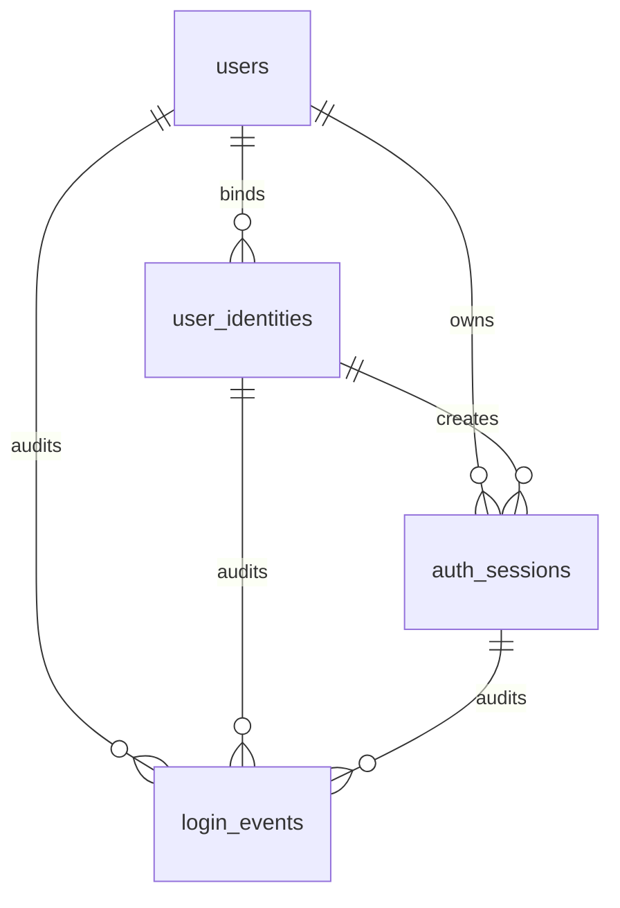
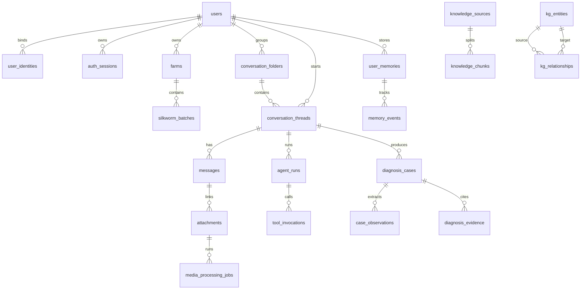

# Can Wen 数据库表设计 v1

这版先把表结构设计好，并把登录范围收敛到第一版实际要做的能力：手机号验证码登录和邮箱验证码登录。微信登录、扫码状态、OAuth state、密码登录表先不设计，后续需要时再加，不影响现在的账号主体和身份绑定模型。

## 当前登录表

| 表 | 作用 |
| --- | --- |
| `users` | 用户主体表，表示系统里的一个用户。 |
| `user_identities` | 登录身份绑定表，目前只支持 `phone` 和 `email`。同一个用户可以同时绑定手机号和邮箱。 |
| `auth_verification_codes` | 手机号/邮箱验证码记录，保存验证码 hash、用途、状态、过期时间和尝试次数。 |
| `auth_sessions` | 登录会话表，保存 refresh token hash、设备信息、过期和吊销状态。 |
| `login_events` | 登录事件审计表，记录验证码请求、校验成功/失败、登录成功/失败、登出、会话吊销等事件。 |

第一版不建 `wechat_login_challenges`，也不在 `user_identities` 里放 `wechat_open_id` 或 `wechat_union_id`。以后加微信登录时，只需要把 `user_identities.provider` 扩展出 `wechat`，再新增微信扫码 challenge 表。

第一版也不建密码表。邮箱登录按“邮箱验证码登录”处理；如果以后需要邮箱密码登录，再单独新增 `password_credentials`，不要把密码 hash 放进 `users`。

## 登录关系

## 登录流程

1. 用户输入手机号或邮箱，请求验证码。
2. 后端写入 `auth_verification_codes`，只保存 `code_hash`，不保存明文验证码。
3. 用户提交验证码，后端检查 `provider + target + purpose` 下最近可用验证码。
4. 校验成功后，查找或创建 `users`，再查找或创建 `user_identities`。
5. 创建 `auth_sessions`，refresh token 只保存 hash。
6. 每个关键动作写入 `login_events`，方便排查、安全审计和风控。

## 主要字段说明

### `users`

用户主体表只放全局信息：

- `id`
- `display_name`
- `username`
- `avatar_url`
- `role`
- `status`
- `registered_at`
- `last_seen_at`
- `created_at`
- `updated_at`

### `user_identities`

身份绑定表用于统一手机号和邮箱：

- `user_id`
- `provider`: `phone` 或 `email`
- `provider_subject`: 规范化后的唯一身份值，例如 `+8613800000000` 或小写邮箱
- `phone_country_code`
- `phone_number`
- `email`
- `is_primary`
- `verified_at`
- `bound_at`
- `unbound_at`

关键约束：`provider + provider_subject` 在未解绑状态下唯一，避免同一个手机号或邮箱绑定到多个用户。

### `auth_verification_codes`

验证码表支持登录和绑定身份：

- `provider`: `phone` 或 `email`
- `target`: 规范化手机号或邮箱
- `code_hash`
- `purpose`: `login` 或 `bind_identity`
- `status`: `pending`、`used`、`expired`、`blocked`
- `attempt_count`
- `max_attempts`
- `expires_at`
- `used_at`

验证码建议设置较短 TTL。业务上可以定期把过期验证码状态更新为 `expired`，也可以查询时按 `expires_at` 判断是否可用。

### `auth_sessions`

会话表只保存 refresh token hash，不保存明文 token：

- `user_id`
- `identity_id`
- `refresh_token_hash`
- `status`: `active`、`revoked`、`expired`
- `device_id`
- `device_name`
- `ip_address`
- `user_agent`
- `expires_at`
- `last_used_at`
- `revoked_at`

Access token 可以用短期 JWT，不一定入库；refresh token 用这张表支持吊销、换新和多端管理。

### `login_events`

登录事件表记录安全审计：

- `user_id`
- `identity_id`
- `session_id`
- `provider`
- `target`
- `event_type`
- `failure_reason`
- `ip_address`
- `user_agent`
- `metadata`

`event_type` 当前包括：验证码请求、验证码成功/失败、登录成功/失败、登出、会话刷新、会话吊销、身份绑定。

## 业务数据边界

- PostgreSQL 保存用户、登录、业务会话、病例、证据、记忆、设置、审计等强一致业务数据。
- MinIO 保存图片、视频、音频、文档等原始文件，PostgreSQL 只保存 `object_key`、文件元数据和处理状态。
- Qdrant 保存向量，PostgreSQL 保存 `qdrant_collection`、`qdrant_point_id`，方便从业务对象反查向量。
- Neo4j 保存疾病知识图谱主数据，PostgreSQL 保留一份实体和关系索引，便于管理、审计和与 RAG 证据统一展示。
- OpenSearch 可用于全文检索，PostgreSQL 中预留 `opensearch_doc_id`。

## 全局关系概览

对应 DDL 文件见 [schema_v1.sql](./schema_v1.sql)。
