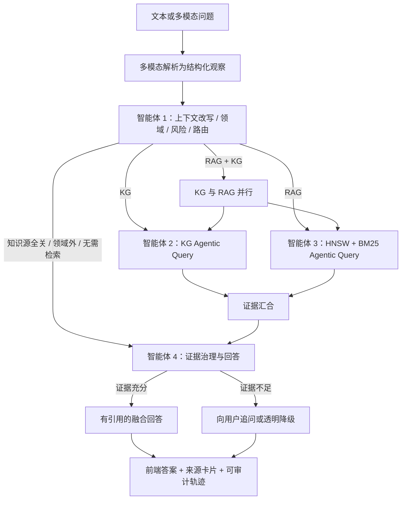

# 用户端证据型问诊四智能体架构

更新日期：2026-07-22

## 目标与边界

用户端问诊不再直接返回通用大模型知识。除问候、领域外问题等无需检索的消息外，回答必须经过管理端已发布知识快照，并在证据不足时追问或明确降级，不得退回纯模型答案。

本阶段不启用长期记忆。上下文使用当前问题、会话摘要、较早消息压缩层、有限窗口的近期会话、本轮结构化养殖数据、多模态观察结果和上一轮待补充字段。历史助手回复只用于理解指代，不作为事实证据。

## 技术选型

| 层次 | 选型 | 职责 |
| --- | --- | --- |
| API 与鉴权 | FastAPI | 会话、消息、多模态、运行查询和 SSE 接口 |
| 智能体编排 | LangGraph | 四智能体有界状态图、条件路由和 KG/RAG 并行汇合 |
| 运行与审计 | PostgreSQL + SQLAlchemy | 运行、公开事件、证据、消息关联和发布快照 |
| 向量召回 | Qdrant HNSW | 语义召回管理端发布的 QA 向量 |
| 关键词召回 | OpenSearch BM25 + jieba 领域词典 | 中文精确词、病名、症状和操作术语召回 |
| 图谱查询 | Neo4j Aura | 固定参数化 Cypher 的实体关系和相邻路径查询 |
| 模型能力 | OpenAI-compatible Chat + Embedding + Rerank | 查询规划、查询改写、证据审查、精排和受约束回答 |
| 前端实时过程 | `fetch` 流式 SSE | 展示步骤、路由、查询轮次、命中数、降级和来源 |

Embedding 模型、维度、向量集合、BM25 索引和 Aura 数据库必须与管理端构建/发布配置一致。查询侧使用共享知识模型凭据，不复用用户个人聊天模型密钥。

## 总体流程

## 四个智能体

### 智能体 1：上下文理解与路由

- 保留不可变的原始问题，并生成可独立检索的问题。
- 会话摘要与较早消息压缩为滚动摘要；最近会话再按消息数和字符数双重截断，长指代追问会绑定最近用户问题或滚动摘要。
- 合并本轮结构化养殖数据、多模态观察和上一轮待补充字段。
- 同时判断领域、意图、风险等级、实体和缺失字段。
- 输出 HNSW 语义查询、BM25 关键词查询、KG 实体词以及 `rag | kg | hybrid | clarify | out_of_domain | non_knowledge` 路由。
- 模型不可降低规则识别到的风险；模型不可用时使用可审计规则继续路由。

推荐路由：

| 问题类型 | 路由 |
| --- | --- |
| 操作规范、剂量、消毒流程、长文本事实 | RAG |
| 实体属性、病原、症状、传播和关系查询 | KG |
| 症状判断、原因分析、鉴别与综合处置 | RAG + KG |
| RAG 与 KG 均被用户关闭 | 明确提示至少启用一个知识源 |

域内知识问题即使缺少部分现场字段，也先进入 RAG、KG 或联合检索；是否需要追问由智能体 4 在检索后的充分性门禁中决定。

### 智能体 2：KG Agentic Query

每轮执行“计划 → 参数化查询 → 覆盖度观察 → 查询修正”。第一轮做实体/别名匹配；覆盖不足时从已命中的疾病或症状实体提取锚点，扩展诊断依据、发生条件和防治关系。最多执行配置的三轮，默认两轮。

模型只生成实体词和扩展词，不生成可直接执行的 Cypher。数据库查询使用固定模板、参数绑定、已发布 `publication_id` 过滤和 Aura 加密连接。

### 智能体 3：RAG Agentic Query

HNSW 与 BM25 在每轮内并行：

1. HNSW 使用与管理端一致的 Embedding 模型和维度生成查询向量。
2. BM25 使用原问题、实体词和 jieba 领域分词进行精确召回。
3. 两路结果使用 RRF 融合；同一 QA 在两路命中时合并通道信息。
4. 覆盖不足时，基于命中摘要生成互补的语义查询和关键词查询，再执行下一轮。
5. 候选结果交给 Rerank；精排不可用时保留 RRF 顺序并记录降级。

所有查询都限定在本次运行开始时冻结的管理端“当前已发布版本”快照内。

### 智能体 4：证据治理与回答

- 对 KG 路径、RAG 文档和本轮用户观察进行归一化。
- 按证据键、源版本/Chunk 和文本相似度去重，保留通道合并信息。
- 使用规则检测明显冲突，并让模型做结构化覆盖/冲突复核；模型只能收紧充分性门槛，不能绕过规则门槛。
- RAG 路由至少需要文档证据；KG 路由至少需要图路径；联合路由同时需要两类证据。高风险问题还要求两个独立资料来源或专家复核。
- 证据不足时返回缺失信息清单；检索基础设施失败时明确说明降级，绝不改用模型常识补答案。
- 证据充分时，模型只能使用编号证据生成回答。非法引用会被移除；完全没有有效引用时回退到确定性有引用模板。
- 返回来源名称、版本、位置、通道、摘要和安全的 HTTP(S) 链接。

## 上下文管理

一次运行的上下文分为：

- `original_question`：不可变审计输入。
- `conversation_summary`：会话的服务端摘要，最多 1200 字。
- `rolling_summary`：会话摘要与最近窗口之前消息的有界压缩层，助手片段明确标记为非证据。
- `recent_conversation`：最多 10 条、6000 字；助手内容标记为 `conversation_only_not_evidence`。
- `structured_husbandry_data`：本轮用户填写的蚕龄、温湿度、异常比例等。
- `multimodal_observations`：图像/视频/文档解析后的结构化观察，不直接作为外部权威来源。
- `pending_clarification_slots`：从上一轮 `waiting_for_user` 运行继承。
- `knowledge_snapshot`：运行开始时冻结的当前发布记录、源版本和三个存储目标。

检索临时草稿不进入长期记忆，前端也不提供长期记忆写入开关。

## 运行记录与前端过程

`agent_runs` 保存状态、路由、风险、改写问题、上下文摘要、知识快照和指标；`agent_run_events` 保存严格递增的公开事件；`agent_evidence` 保存本轮证据及来源。

新建、续问、多模态和重新生成都使用 SSE：

- `ready`：连接建立。
- `process`：智能体、阶段、状态、公开摘要、查询轮次和命中数量。
- `final`：最终会话/消息和完整运行摘要。
- `error`：经过脱敏的可操作错误。

运行详情和事件可通过 `GET /diagnosis/agent-runs/{run_id}` 与 `/events?after_sequence=N` 回放；事件流接口支持从序号继续读取。公开事件永不保存或返回 Prompt、密钥、Token、向量、Embedding、Cypher 或模型内部推理。

## 失败策略

| 场景 | 行为 |
| --- | --- |
| 路由模型失败 | 使用确定性规则继续 |
| HNSW 或 BM25 单路失败 | 保留另一通道，记录降级 |
| Rerank 失败 | 保留 RRF 顺序 |
| KG 在联合路由失败 | RAG 可继续，但充分性门槛仍生效 |
| 无已发布知识 | 返回透明降级，不调用纯模型回答 |
| RAG 与 KG 都被关闭 | 明确提示在设置中至少启用一个知识源 |
| 证据不足 | 生成结构化追问 |
| 高风险且来源不足/冲突 | 不给确定性诊断，提示隔离与人工复核 |
| 主流程异常 | 保存失败事件，返回安全提示，不切换到旧模型接口 |

旧的 `POST /diagnosis/chat` 纯模型入口、请求模型和响应模型均已删除；该路径不再出现在 OpenAPI 中。

## 上线与质量门槛

- 管理端必须完成审核和发布；仅构建成功但未发布的数据不会被用户端检索。
- 生产环境需配置共享 Embedding/Rerank 密钥、Qdrant/OpenSearch 认证及 Neo4j Aura 最小权限只读账号。
- 监控成功率、各通道延迟、每轮命中数、改写次数、降级率、追问率、引用覆盖率和用户反馈。
- 建立固定问题集，分别评估路由准确率、Recall@K、MRR/nDCG、图路径命中率、证据充分性误放率、冲突检出率和引用正确率。
- 药剂剂量、高风险死亡/扩散等问题应采用更严格的来源与专家复核策略。
- 长期记忆仅在单独完成授权、可查看/修改/删除、过期策略和隐私审计后再启用。
