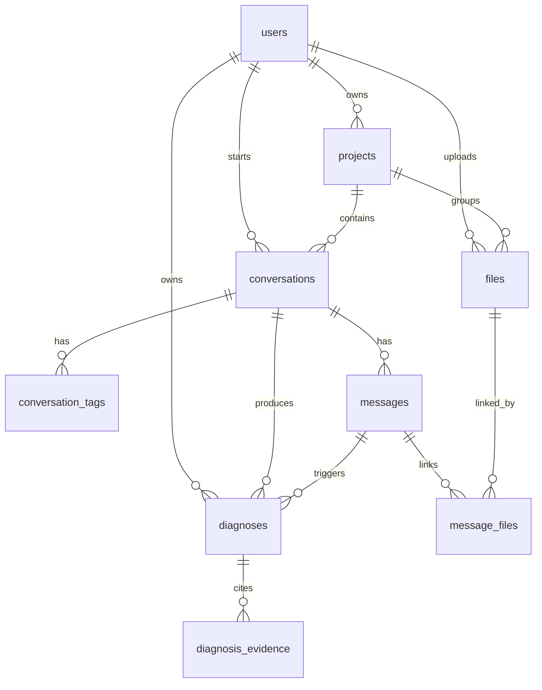

# P0 核心业务表

本文件记录当前 P0 已落地到模型和 Alembic 迁移的业务表。项目共享暂不做，因此没有 `project_members`。

## 已有登录表

| 表 | 作用 |
| --- | --- |
| `users` | 用户主表 |
| `user_identities` | 手机号/邮箱登录身份 |
| `auth_verification_codes` | 登录验证码 |
| `auth_sessions` | 登录会话 |
| `login_events` | 登录审计事件 |

## P0 新增表

| 表 | 作用 |
| --- | --- |
| `projects` | 项目文件夹 |
| `conversations` | 问诊对话，`project_id` 为空表示不在项目中 |
| `conversation_tags` | 对话标签 |
| `messages` | 对话消息 |
| `files` | 上传文件 |
| `message_files` | 消息与文件关联 |
| `diagnoses` | 诊断任务和诊断结果 |
| `diagnosis_evidence` | 诊断依据 |

## 关系

## 状态枚举

| 字段 | 值 |
| --- | --- |
| `projects.status` | `active` / `archived` / `deleted` |
| `conversations.conversation_type` | `diagnosis` / `video` / `general` |
| `conversations.status` | `active` / `archived` / `deleted` |
| `messages.sender_type` | `user` / `assistant` / `system` |
| `messages.message_type` | `text` / `image` / `video` / `file` / `diagnosis_result` |
| `messages.status` | `sending` / `sent` / `failed` |
| `files.file_type` | `image` / `video` / `document` / `audio` / `other` |
| `diagnoses.status` | `pending` / `running` / `completed` / `failed` |
| `diagnosis_evidence.evidence_type` | `symptom` / `rag_document` / `graph_path` / `rule` / `image` |
