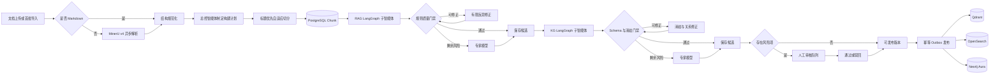

# 养蚕领域 RAG / KG 双智能体实现方案

本文档对应当前仓库中的可运行实现。用户端检索和问答编排不在本阶段范围内；本阶段只负责把原始资料构建成可审核、可追溯、可发布的 RAG 数据与疾病知识图谱。

## 1. 已确定技术栈

| 层次 | 选型 | 用途 |
| --- | --- | --- |
| 智能体编排 | LangGraph | 顶层构建图、RAG 子智能体、KG 子智能体、PostgreSQL checkpoint |
| 异步任务 | Celery + Redis | 构建、发布、失败重试、任务取消与进度同步 |
| 文档解析 | MinerU API v4，`vlm` | PDF、Word、PPT、图片转 Markdown；首批 Markdown 直接进入切分 |
| 业务与追溯数据 | PostgreSQL | 文档版本、Chunk、QA、三元组、审核、发布、Outbox、审计 |
| RAG 向量库 | Qdrant | 以“问题”的 1024 维向量为检索入口 |
| BM25 | OpenSearch + Jieba 领域词典 | 中文关键词倒排检索；答案和证据不参与全文索引 |
| KG | Neo4j Aura | 唯一业务图数据库；严格 11 类实体、10 类关系，支持 React Flow 预览 |
| 对象存储 | 本地目录或 S3 兼容接口 | 原文件、MinerU 压缩包、Markdown 结果 |
| 管理端 | FastAPI + React + React Flow | 文档、任务、人工审核、图谱预览和审计 |

模型默认配置：

- QA / KG 抽取：`qwen3.7-plus-2026-05-26`
- 风险项专家评审：`qwen3.7-max-2026-06-08`
- Embedding：`text-embedding-v4`，固定 1024 维
- Rerank：`qwen3-rerank`

所有模型配置均可在管理端“模型与任务”覆盖；密钥加密保存且不回显。环境变量是数据库配置不可用时的后备来源。

## 2. 总体流程



顶层 LangGraph 节点顺序：

1. `load_document`
2. `plan_document`
3. `adaptive_chunk`
4. `persist_chunks`
5. 根据 targets 条件进入 `rag_agent`、`kg_agent` 或 `finalize`
6. `finalize`

RAG 子图为 `rag_extract -> rag_evaluate -> rag_revise(最多两轮)/rag_expert_review -> rag_persist`；KG 子图为 `kg_extract -> kg_evaluate -> kg_resolve(最多两轮)/kg_expert_review -> kg_persist`。质量节点使用 LangGraph 条件边决定直接保存、反思修正或专家评审。每个构建运行使用独立 `thread_id`，PostgreSQL checkpoint 支持 Worker 异常后的节点级恢复。

总控规划器会分析标题层级、估算 token、表格行、问答标记和知识密度，记录选定的知识章层级、工具链、执行顺序、切分策略、反思上限和规划理由。该计划随构建配置快照保存，不依赖不可审计的隐式推理。

## 3. 文档与切分策略

### 3.1 MinerU

非 Markdown 文档执行以下协议：

1. `POST /api/v4/file-urls/batch` 获取 `batch_id` 和签名上传地址。
2. 对签名地址执行 `PUT` 流式上传。
3. `GET /api/v4/extract-results/batch/{batch_id}` 指数退避轮询。
4. 下载 `full_zip_url`，安全解压其中的 `full.md`。
5. 保存原文件、结果压缩包、Markdown 和解析元数据。

Token 只通过 `Authorization: Bearer ...` 发送，异常日志不记录 Token。上传文件默认上限 200 MB，MinerU 结果包和 `full.md` 另有独立大小保护。

### 3.2 自适应切分

- 默认把 H3 作为完整知识章。
- 文档没有 H3 时自动退到 H2，适配问答型资料。
- 小节不超过约 1200 token 时整块保留。
- 超长章节依次下钻 H4、H5。
- 仍超长时由模型做连续原文语义切分；必须完整覆盖原文、不得改写。
- 模型切分不合法或不可用时，使用确定性段落/句子回退切分。
- 短但结构完整的小节标记为 `short_but_complete`，不会按低质量碎片处理。
- 每个 Chunk 保存标题路径、原文行号、内容 SHA、token 数、切分策略和质量标记。

首批 5 份资料预切分结果为 574 个 Chunk，全部不超过配置上限，且不存在只有标题没有正文的 Chunk。

## 4. RAG 文档构建智能体

动态 QA 数量由 Chunk 长度、知识密度和表格情况共同决定：

- `<= 350 token`：基础 1 条
- `351–700 token`：基础 3 条
- `> 700 token`：基础 5 条
- 症状、病因、步骤、温湿度、剂量、防治、诊断等高密度内容最多加 2 条
- 表格最多加 1 条
- 单 Chunk 最多 8 条

QA 输出字段包括问题、答案、逐字原文证据、关键词、知识类型和置信度。答案可以在不增加事实的前提下重组说明，但数字、剂量、浓度、温度和时长必须能在原文中找到。

规则质检至少检查：

- 空问题、空答案、答案过短
- “它应该怎么处理”一类依赖上下文的泛化问题
- 证据不是原文连续子串
- 答案新增原文不存在的数字或参数
- 关键词缺失
- 低质量 Chunk

风险项优先进入最多两轮的反思修正；每轮修正后重新执行证据、参数和问题质量校验。仍有风险时才调用独立专家模型，避免对所有候选重复付费。未达到自动通过阈值的候选进入人工队列。修正轮次、每轮修正前后风险、专家触发原因和最终路由都随候选保存。

发布时：

- Qdrant 文本：问题向量
- Qdrant payload：问题、答案、证据、来源、版本、Chunk、标题路径、关键词、知识类型、发布日期
- OpenSearch 索引：原问题和经 Jieba + 676 条养蚕领域词表切分后的 `question_tokens`
- OpenSearch 中答案与证据只保存、不建立全文索引

## 5. KG 构建智能体

KG 只允许以下 11 个标签：

`Disease`、`DiseaseCategory`、`Cause`、`Symptom`、`Lesion`、`Part`、`Route`、`Condition`、`Stage`、`Diagnosis`、`Measure`。

只允许以下 10 个方向明确的关系：

| 关系 | 主语 | 宾语 |
| --- | --- | --- |
| `BELONGS_TO` | Disease | DiseaseCategory |
| `CAUSED_BY` | Disease | Cause |
| `HAS_SYMPTOM` | Disease | Symptom |
| `HAS_LESION` | Disease | Lesion |
| `AFFECTS_PART` | Disease | Part |
| `HAS_ROUTE` | Disease | Route |
| `OCCURS_UNDER` | Disease | Condition |
| `OCCURS_IN` | Disease | Stage |
| `DIAGNOSED_BY` | Disease | Diagnosis |
| `CONTROLLED_BY` | Disease | Measure |

不会创建 `Document`、`Evidence`、`DrugParameter` 等扩展节点。证据、来源章节和版本作为 PostgreSQL 记录及 Neo4j 关系属性保存；剂量、浓度等参数留在 `Measure` 文本和证据中。

实体融合规则：

- 仅自动应用词表中标记为 `confirmed` 的同义词规则。
- `context_required`、`expert_review` 等歧义名称保持原样并强制人工审核。
- 三元组按“标准主语 + 类型 + 关系 + 标准宾语 + 类型”计算稳定 SHA 键并去重。
- 关系方向或实体类型不符合 Schema 时不允许发布。
- 普通养殖章节没有疾病三元组属于正常跳过，不误报为抽取失败。

可修正的 Schema、证据和歧义风险会进入最多两轮的 `kg_resolve` 循环，每轮均重新执行固定 Schema、证据子串和领域词表校验。无法可靠消歧的名称不会被模型强制合并，而是继续进入专家或人工审核。

Neo4j Aura 会先读取现有 Schema；若某个中文标签的 `name` 已有普通索引或约束索引则直接复用，仅为缺失标签补充非破坏性的名称查找索引，避免与既有图谱约束冲突。关系保存 `source_refs`、最新证据、最新来源信息和发布版本，实现可追溯合并。智能体内部英文 Schema 会在写入边界映射为现有图谱的中文标签和中文关系类型，不创建第二套英文标签节点。

## 6. 数据质量与审核

构建运行有以下主要状态：

`queued -> running -> awaiting_review/succeeded -> publishing -> succeeded`

异常时进入 `failed`，取消时进入 `cancelled`。人工队列支持 QA、三元组和 Chunk 三类风险项；审核提交必须携带当前版本号，避免并发覆盖。

人工修订仍受硬校验约束：

- QA 证据必须存在于来源 Chunk。
- 三元组类型和关系必须符合 Schema。
- 三元组证据必须存在于来源 Chunk。
- 通过、驳回、修订内容和理由全部写审计日志。

只要还有开放审核项，就不能发布。全部审核完成后运行自动转为 `succeeded`。

## 7. 幂等发布

发布不是直接对三个存储做不可追踪写入，而是先在 PostgreSQL 生成唯一 Outbox 事件：

`publication_id + target + aggregate_type + aggregate_id + operation`

每个事件记录目标、payload、尝试次数、状态和错误。失败重试只处理 `pending/failed/processing` 事件，已成功事件不会重复写。Qdrant、OpenSearch 和 Neo4j 均使用稳定业务 ID / `MERGE`，因此 Worker 重启后可安全续传。

## 8. 管理 API

API 前缀为 `/api/admin/v1`。

| 方法 | 路径 | 作用 |
| --- | --- | --- |
| GET | `/knowledge/overview` | 知识构建概览 |
| GET/POST | `/knowledge/sources`、`/knowledge/sources/upload` | 文档列表与上传 |
| GET/PATCH | `/knowledge/sources/{id}`、`/knowledge/sources/{id}/status` | 版本详情与启停 |
| POST | `/knowledge/sources/{id}/build` | 创建 RAG、KG 或双目标构建 |
| GET | `/knowledge/builds`、`/knowledge/builds/{id}` | 任务、指标、智能体计划、工具轨迹、质量路由和 Chunk 决策 |
| GET/PATCH | `/knowledge/reviews`、`/knowledge/reviews/{id}` | 审核队列与决定 |
| POST | `/knowledge/builds/{id}/publish` | 创建发布任务 |
| GET | `/knowledge/publications` | 发布记录 |
| GET | `/knowledge/graph/preview` | Neo4j 图谱预览 |

读取需要 `knowledge.read`，写操作需要 `knowledge.manage`。上传、启停、构建、审核、发布均写管理员审计日志。

## 9. 单机运行

开发模式：

```powershell
docker compose -f docker-compose.dev.yml up -d postgres redis qdrant opensearch

cd backend_mger
uv sync --dev
uv run alembic upgrade head
uv run uvicorn app.main:app --host 127.0.0.1 --port 8020 --reload

# 另一终端
uv run celery -A app.celery_app:celery_app worker --loglevel=INFO --concurrency=2
```

完整容器模式：

```powershell
docker compose -f docker-compose.dev.yml up -d --build
```

容器模式包含 PostgreSQL、一次性用户 Schema 初始化、Redis、Qdrant、OpenSearch、管理 API、知识 Worker 和管理端静态页面。Neo4j 不启动本地容器，管理 API 与 Worker 统一连接 Aura。空数据库启动时会先执行用户端 Alembic，再执行管理员端 Alembic，避免审核触发器先于业务表创建。`backend_mger/.env` 是必需且被 Git 忽略的本机密钥文件，其中保存 Aura、MinerU 和模型凭据。
为避免与本项目已有的宿主机 PostgreSQL 冲突，容器 PostgreSQL 默认映射到宿主机 `5434`，容器内部仍使用 `5432`。若 `5175` 已被开发服务器占用，可在启动前设置 `$env:ADMIN_WEB_PORT = '5176'`。

容器数据库首次启动后，可用一次性 `seed` profile 将宿主机首批 Markdown 导入共享知识卷；路径可通过 `INITIAL_KNOWLEDGE_DIR` 覆盖：

```powershell
$env:INITIAL_KNOWLEDGE_DIR = 'C:\Users\w\Desktop\mrakdown文档\data\05_qa_ready_md'
docker compose -f docker-compose.dev.yml --profile seed run --rm knowledge-seed
```

## 10. 首批文档

首批真实资料已按 `initial-2026-07-20` 版本登记：

1. 《实用养蚕技术200问》
2. 《简明养蚕手册》
3. 《中国养蚕学》
4. 《家蚕病理学》
5. 《常见蚕病防治》

可重复执行以下命令；相同标题、版本和内容 SHA 会幂等跳过：

```powershell
cd backend_mger
uv run python -m scripts.import_initial_knowledge
```

也可用 `--directory <目录>` 导入指定目录内的全部 `.md`/`.markdown` 文档。

增加 `--enqueue` 会同时创建双目标构建任务。由于完整 5 本资料会产生大量模型调用，建议先在管理端逐本构建并观察审核率，再决定并发和成本预算。

## 11. 当前验收基线

- 后端自动测试覆盖 Schema、切分、证据校验、参数幻觉、歧义消解、规划器、质量条件路由、反思后重校验、MinerU 协议、模型结构化响应和三张 LangGraph。
- Alembic `check` 必须无漂移。
- 前端必须通过 TypeScript 和 Vite 生产构建。
- DashScope 对话、Embedding 1024 维和 Rerank 均有最小真实连通测试。
- MinerU 凭据更新后执行 `python -m scripts.smoke_mineru <小型PDF> --expect <预期文本>`，验证签名上传、异步轮询、结果 ZIP、`full.md`、标题/表格保留、自适应切分以及验收数据自动清理。该命令会消耗一次 MinerU 文档解析额度。
- Docker Compose 必须通过配置校验；基础服务启动后执行 `uv run python -m scripts.smoke_knowledge_stores`，以随机临时名称验证 Redis、Qdrant、OpenSearch BM25 和 Neo4j Aura 的写入、读取与清理。
- 完整容器栈启动后执行 `docker exec canw-admin-api python -m scripts.smoke_knowledge_e2e`，用隔离文档验证 Celery、LangGraph 双智能体、审核、发布和三类索引的一致性；脚本会调用少量真实模型并自动清理验收数据。
